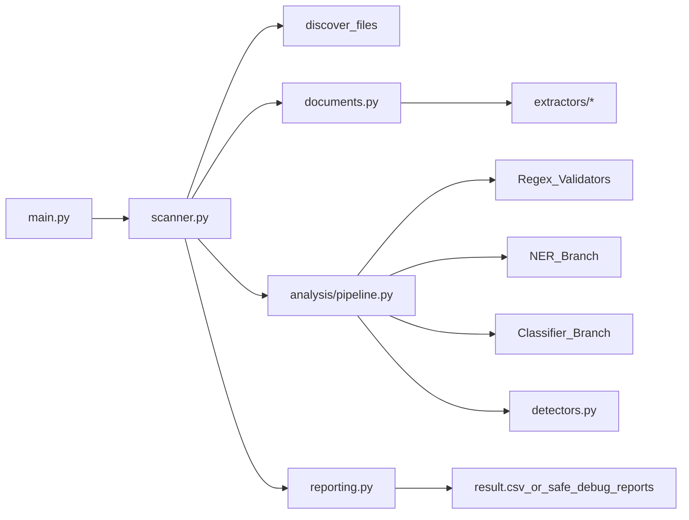

# Сканер ПДн

CLI-приложение для рекурсивного сканирования файлового хранилища, извлечения текста, поиска признаков ПДн и формирования отчета.

## Архитектура



## Модули

- `main.py` — CLI-контракт и запуск пайплайна.
- `scanner.py` — обход дерева файлов, orchestration и безопасный отбор только файлов с ПДн.
- `documents.py` — фасад для extractors.
- `extractors/` — отдельные обработчики по форматам.
- `analysis/` — три параллельные ветки анализа текста одного документа.
- `detectors.py` — regex-детекторы, валидация (`Luhn`, `СНИЛС`, `ИНН`), правила агрегации и присвоения `УЗ`.
- `reporting.py` — запись итогового `result.csv` и безопасных debug-отчетов.
- `models.py` — общие dataclass-контракты.

## MVP-форматы

Подтвержденно обработаны в коде:

| Формат | Стратегия |
| --- | --- |
| `txt` | Прямое чтение текста с автоопределением кодировки |
| `csv` | Потоковое чтение строк через `csv` |
| `json` | Рекурсивное flatten-представление структуры |
| `html`, `htm` | Удаление тегов и извлечение текстового контента |
| `docx` | `python-docx`, при отсутствии — чтение `word/document.xml` из zip |
| `rtf` | `striprtf`, при отсутствии — regex cleanup |
| `pdf` | `pypdf` -> `PyPDF2` -> `pdfminer.six` -> извлечение строк из PDF stream/binary |
| `xls`, `xlsx` | `openpyxl`/`xlrd`, при отсутствии — binary strings fallback |
| `doc` | Binary strings fallback |
| `jpg`, `jpeg`, `png`, `gif`, `tif`, `tiff` | `EasyOCR` -> `Tesseract` -> binary fallback |

## Аналитический конвейер

После извлечения текста каждый документ проходит 3 параллельные ветки анализа:

- `Regex + validators` — телефоны, email, СНИЛС, ИНН, паспорта, MRZ, карты, счета, БИК, CVV.
- `NER-like branch` — ФИО, даты, место рождения, адреса.
- `Classifier branch` — биометрические и специальные категории ПДн по контекстным признакам.

В выходных отчетах сохраняется только факт наличия ПДн и метаданные файла, без исходных значений персональных данных.

## Поддерживаемые категории ПДн

- Обычные: ФИО, телефоны, email, дата рождения, место рождения, адресные признаки.
- Государственные идентификаторы: паспорт РФ, СНИЛС, ИНН, водительское удостоверение, MRZ.
- Платежные: PAN карт с проверкой Луна, расчетный счет, БИК, CVV.
- Биометрические: по ключевым словам.
- Специальные категории: по ключевым словам.

## Правила присвоения УЗ

- `УЗ-1`: найдены специальные или биометрические ПДн.
- `УЗ-2`: найдены платежные данные или большой объем государственных идентификаторов.
- `УЗ-3`: найдены государственные идентификаторы или много обычных ПДн.
- `УЗ-4`: найдены только обычные ПДн.
- `нет признаков`: совпадения не найдены.

## CLI

```bash
python main.py "ПДнDataset/share" --output result.csv --output-format csv
```

Параметры:

- `root` — корневая директория сканирования.
- `--output` — путь к отчету; для хакатона основной файл должен быть `result.csv`.
- `--output-format` — `csv`, `json`, `md`; `csv` пишет строгий формат `size,time,name`.
- `--include-ext` — список расширений для анализа.
- `--max-text-chars` — лимит текста на файл.
- `--max-structured-rows` — лимит строк/элементов для `csv/json`.
- `--enable-ocr` — включить OCR, если зависимости установлены.
- `--include-empty-results` — включить файлы без находок.
- `--analysis-workers` — число параллельных веток анализа текста.

## Формат результата хакатона

При `--output-format csv` формируется файл строго такого вида:

```csv
size,time,name
3068287,sep 26 18:31,CA01_01.tif
```

В `result.csv` попадают только файлы, для которых найдены признаки ПДн.

## Опциональные зависимости

Для более качественного извлечения текста можно установить:

```bash
python -m pip install pypdf PyPDF2 pdfminer.six python-docx beautifulsoup4 xlrd openpyxl striprtf pillow pytesseract easyocr
```

Я не могу подтвердить установку этих библиотек в текущем окружении автоматически через `pip`, потому что попытка установки завершилась ошибкой доступа к индексу пакетов.

## План проверки

- Прогон на `ПДнDataset/share/Выгрузки/дочерние предприятия/Employes` для текстовых документов с явными ПДн и проверки `result.csv`.
- Прогон на `ПДнDataset/share/Выгрузки/дочерние предприятия/Billing` для структурированных таблиц.
- Прогон на `ПДнDataset/share/Выгрузки/Сайты` для HTML-шума и проверки ложноположительных срабатываний.
- Прогон на `ПДнDataset/share/Прочее` для PDF/RTF/XLS fallback-веток.

## Backlog улучшений

- Полноценная поддержка `parquet` через отдельный extractor.
- OCR-пайплайн с пакетной обработкой изображений и предпрепроцессингом.
- Параллельное сканирование по файлам.
- Fallback-цепочка из нескольких PDF-парсеров.
- Дедупликация повторяющихся совпадений и контекстная фильтрация ФИО.
- Набор regression-тестов на реальных синтетических примерах из датасета.
